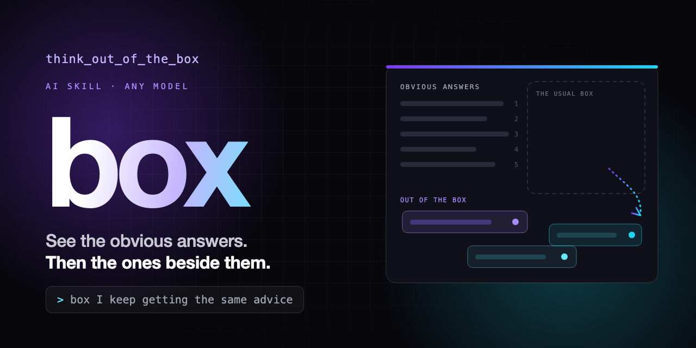

<p align="center"></p>

# think_out_of_the_box

Get ideas that sit outside the usual pile. Start a message with `box`:

```text
box I can't stay consistent with studying
```

AI answers drift to the most common pattern, so the ideas arrive already averaged out. `think_out_of_the_box` makes the assistant show you the **obvious answers** first, clearly labelled and still available, and then up to three **answers out of the box** that break a hidden assumption in your problem. Each one comes with the cheapest way to test it.

## What you get

```text
**Problem:** Weekend sales have been flat for six months. Two staff, one small oven, HKD 3,000 a month.

## Obvious answers
1. Post on Instagram or Xiaohongshu, still the right call if you post under 3 times a week
2. Weekend only special item, still works if regulars say they are bored
3. Bundles or discounts, the right call if you throw away stock at close
   ... (8 in total, kept on purpose; some may be exactly right)

## Hidden assumptions
- Everything is baked in your oven and sold fresh on the same day.
- Customers arrive evenly through the day and find everything available.
- Price only goes down in tests, never up.

## Answers out of the box
### 1. Stretch: Raise the price, don't cut it
### 2. Leap: Sell unbaked, so the customer's appliance does the baking
### 3. Weird but testable: Sell a "showtime", not a shelf
  Each has: Idea / Move used / Assumption broken / Nearest obvious answer and how this differs /
  Cheapest test (under one week) / Biggest risk

Next? (go deeper on 1 / 2 / 3, make a week plan from one, pair one with an obvious answer, new problem, done)
```

The full run is in [`examples/bakery-flat-sales.md`](examples/bakery-flat-sales.md).

## How it works

1. It lists the 5 to 8 obvious answers a thorough AI reply would give, and keeps them, labelled.
2. It names the hidden assumptions inside how you stated the problem.
3. It breaks them with at least five forced moves: invert it, remove the biggest constraint, add an absurd one, borrow a mechanism from a distant field, solve a different problem, make the problem disappear, give it to the opposite person, subtract. See [`lenses.md`](think_out_of_the_box/lenses.md).
4. It checks each candidate against the obvious list. Same mechanism in a new outfit goes to the obvious list. Untestable, over your limits or generic ideas are dropped.
5. It returns a Stretch, a Leap and a Weird but testable idea, each naming its nearest obvious answer and how it truly differs.
6. It never says an idea is new. The only claim is: it is not among the obvious answers listed above.

## What is in this repo?

| File | Use it for |
| --- | --- |
| [`think_out_of_the_box/SKILL.md`](think_out_of_the_box/SKILL.md) | The complete skill, written for Claude Code. |
| [`think_out_of_the_box/lenses.md`](think_out_of_the_box/lenses.md) | The eight moves, each with a small example and a trap. |
| [`PORTABLE.md`](PORTABLE.md) | A short, model neutral version for custom or project instructions. |
| [`examples/`](examples/) | Three real runs: a flat bakery, no friends in a new city, a slow Python script. |
| [`tests/`](tests/) | How it was tested, what failed along the way, and the raw runs. |
| [`assets/`](assets/) | The banner and its HTML source. |

## Install

### Claude Code

1. Download this repository, or copy the folder [`think_out_of_the_box/`](think_out_of_the_box/) (both files).
2. Put it at `~/.claude/skills/think_out_of_the_box/` for all your projects, or at `<your-project>/.claude/skills/think_out_of_the_box/` for one project.
3. Start a new Claude Code session and type `box` followed by your problem.

See the [Claude Code skill documentation](https://code.claude.com/docs/en/skills) for skill locations and invocation. The skill works from `SKILL.md` alone; `lenses.md` is a bonus.

### Codex

1. Download this repository or copy the folder [`think_out_of_the_box/`](think_out_of_the_box/).
2. Put it at `~/.agents/skills/think_out_of_the_box/` for personal use, or at `<your-project>/.agents/skills/think_out_of_the_box/` for one repository.
3. Ask Codex to use the `think_out_of_the_box` skill.

This has not been tested in Codex.

### ChatGPT or another AI

1. Open [`PORTABLE.md`](PORTABLE.md) and copy the text inside its `text` block.
2. Paste it into your AI's custom instructions or project instructions.
3. Start a fresh conversation and type `box` followed by your problem.

This has not been tested outside Claude Code.

## Does it work?

It was tested on three problems against a plain answer from the same AI. The final version gave at least two of three ideas that the plain answer did not contain in 6 of 7 runs. Early versions failed that test on the studying problem, and the fixes are listed in [`tests/results.md`](tests/results.md).

Be careful with what this shows. The tester and the skill author are the same AI, so the scores show the output differs from a plain answer, not that the ideas are good. Try it on a problem you know well and judge for yourself.

## Design rules

- The obvious answers stay. They are real options, so they are listed and labelled, not hidden.
- At most three ideas. Fewer is fine if only two survive.
- Every idea names the assumption it breaks and the nearest obvious answer, so you can see the difference.
- Every idea has a test that takes under a week, with a rough cost.
- No idea is called new or original. The AI cannot check that.
- For health, legal, safety or big money problems, tests stay small and you are told to ask a professional.
- Not for lookups, maths or anything with one right answer.

## Pairs well with

- [`scope`](https://github.com/klmiing1229-a11y/scope): turn a vague wish into a clear task.
- `think_out_of_the_box`: widen the options before you choose.
- [`aicheck`](https://github.com/klmiing1229-a11y/aicheck): check the answer before you rely on it.
- [`lfg-prompt-engineer`](https://github.com/klmiing1229-a11y/lfg-prompt-engineer): turn the idea you pick into a prompt you approve.

## Licence

MIT. See [`LICENSE`](LICENSE).
